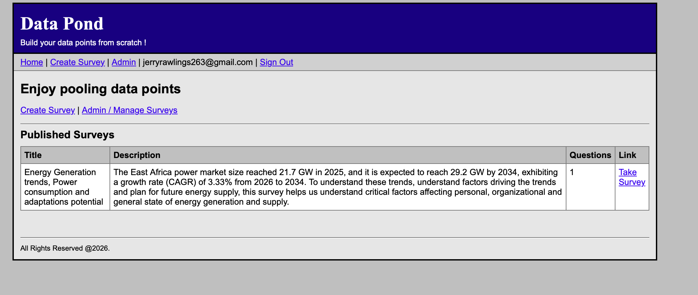
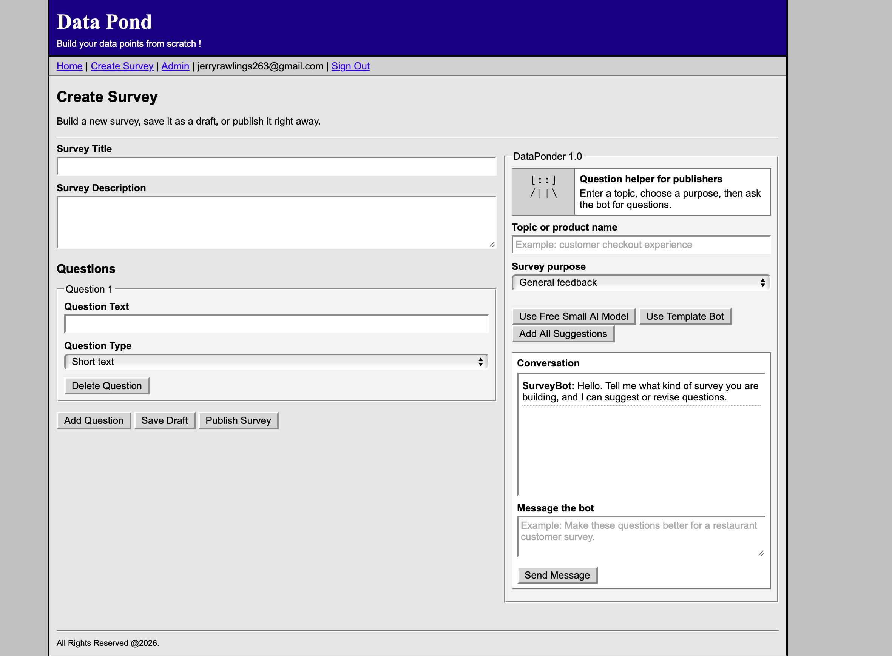
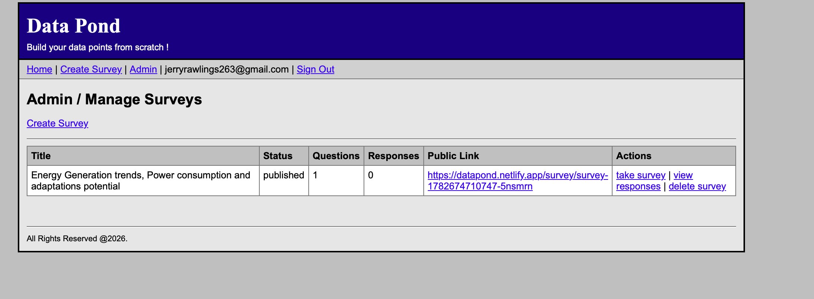

# Data Pond

Own your data points; Create and manage surveys

## Demo

### Home page



### Create survey



### Admin view



## Setup

1. Create a Supabase project.
2. Open the Supabase SQL editor and run `supabase/schema.sql`.
3. In Supabase, go to Authentication > Providers and make sure Email is enabled.
4. In Authentication > URL Configuration, add your local and production site URLs.
5. Copy `.env.example` to `.env`.
6. Fill in `VITE_SUPABASE_URL` and `VITE_SUPABASE_ANON_KEY`.
7. Install and run:

```bash
npm install
npm run dev
```

## Deploy

Use any static host that supports Vite, such as Vercel or Netlify.

Build command:

```bash
npm run build
```

Publish directory:

```text
dist
```

Add these environment variables in the host dashboard:

```text
VITE_SUPABASE_URL
VITE_SUPABASE_ANON_KEY
```

## Security note

Admin pages require Supabase Auth. Published surveys can be viewed and answered by anyone with the public survey link.

## Short links

Published surveys use short first-party links like `/s/customer-feedback-a1b2c3`. Run the latest `supabase/schema.sql` so the `surveys.slug` column and unique index exist before publishing surveys.
